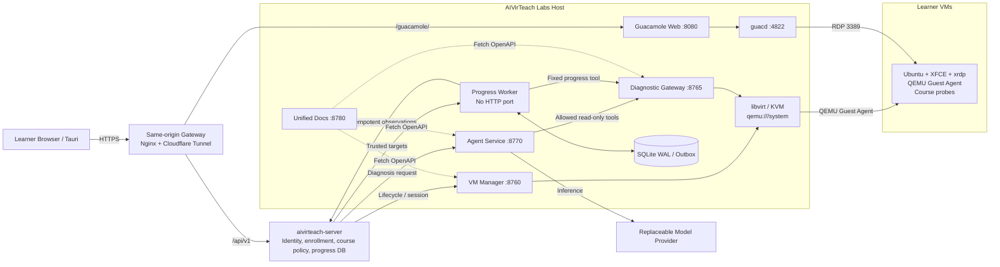
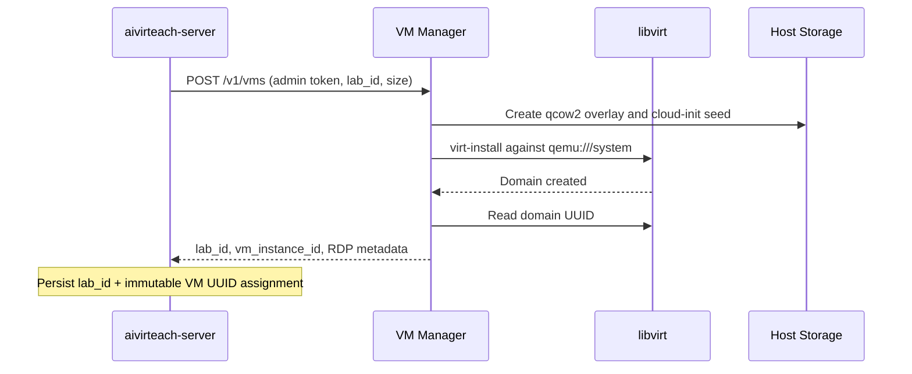
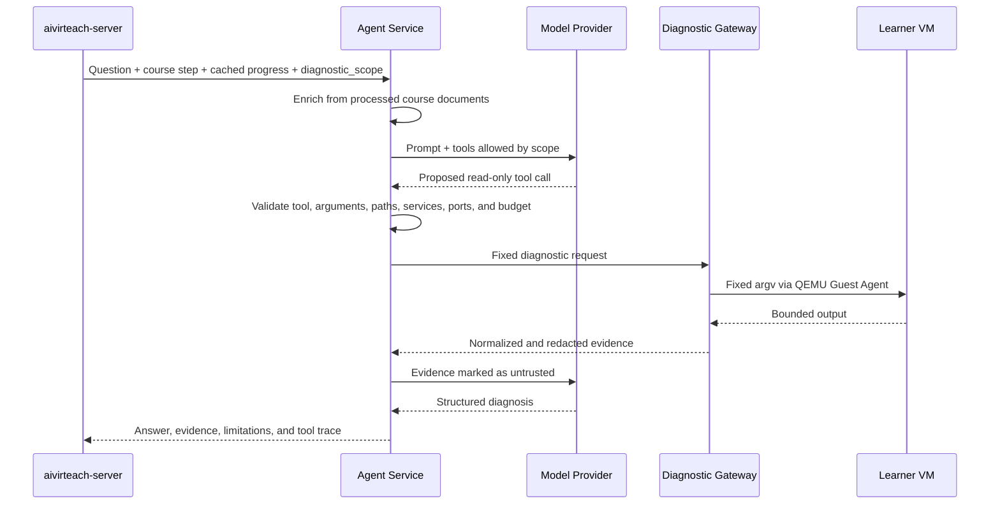
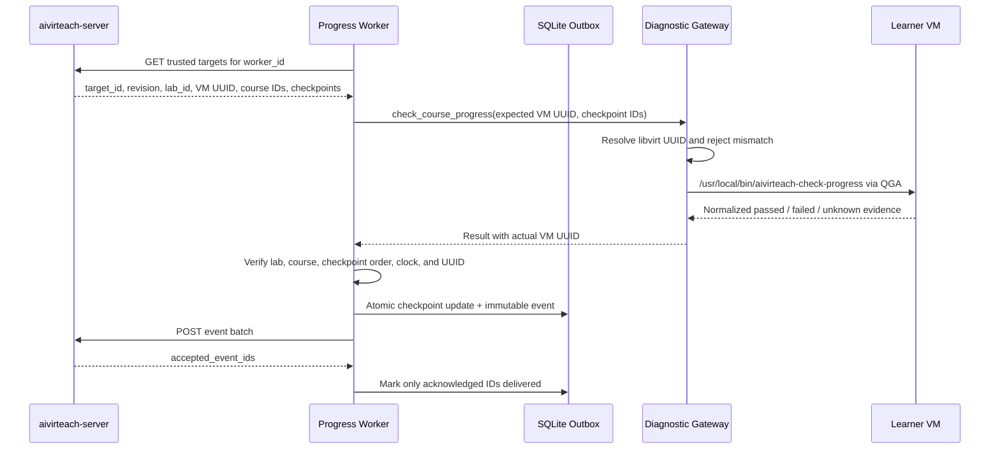

# AIVirTeach Labs Technical Architecture

**Document status:** Current implementation reference  
**Last updated:** 2026-08-30  
**Repository:** `aivirteach-labs`

## 1. Purpose and Scope

`aivirteach-labs` is the execution plane for hands-on AIVirTeach courses. It
creates and controls learner virtual machines, exposes constrained diagnostics,
runs the course-aware troubleshooting agent, provides browser-based RDP access,
and observes course checkpoint progress.

The repository does not own learner identity, enrollment, course progression
policy, or the authoritative progress database. Those responsibilities belong
to `aivirteach-server`. This separation prevents the Labs host from deciding
which VM or course belongs to a learner.

The current architecture contains four HTTP services, one background worker,
Apache Guacamole, and the host libvirt/KVM stack.

## 2. Architectural Principles

1. **Separate services by privilege.** VM lifecycle, read-only diagnostics,
   model reasoning, documentation, and progress delivery run in different
   processes with different credentials.
2. **Keep policy on the Server.** The Server supplies trusted lab assignments,
   course identity, current lesson, diagnostic scope, and progress policy.
3. **Do not expose arbitrary execution.** Diagnostic operations use fixed
   argument templates. The Agent cannot request a shell, write a guest file,
   install software, restart services, or change VM state.
4. **Treat guest and model output as untrusted.** Output is bounded, normalized,
   redacted, and never allowed to expand the tool policy.
5. **Use immutable VM identity.** A `lab_id` is paired with the current libvirt
   UUID (`vm_instance_id`) so a deleted and recreated VM cannot inherit stale
   observations.
6. **Make progress delivery durable and idempotent.** The Progress Worker uses a
   local SQLite WAL/outbox and the Server deduplicates immutable events by
   `event_id`.
7. **Expose one learner-facing origin.** The browser uses the same HTTPS origin
   for the React/Tauri workspace, Server API, and `/guacamole/` path.

## 3. System Context



## 4. Runtime Components

| Component | Default endpoint | Runtime privilege | Primary responsibility |
| --- | --- | --- | --- |
| VM Manager | `127.0.0.1:8760` | Root/libvirt control | Create, inspect, start, stop, reboot, and delete VMs; mint short-lived Guacamole sessions |
| Diagnostic Gateway | `127.0.0.1:8765` | libvirt access | Execute fixed, read-only host and guest diagnostic operations |
| Agent Service | `127.0.0.1:8770` | Unprivileged | Combine course context, model reasoning, and diagnostic evidence |
| Unified Docs Service | `127.0.0.1:8780` | Unprivileged | Merge and display the three runtime OpenAPI documents |
| Progress Worker | No port | Dedicated unprivileged user | Poll trusted targets, observe checkpoints, and reliably deliver progress events |
| Guacamole Web | `127.0.0.1:8080` | Container | Provide browser-compatible remote desktop transport |
| guacd | Container network `4822` | Container | Translate the Guacamole tunnel into RDP connections |
| libvirt/KVM | `qemu:///system` | Host service | Own VM definitions, disks, networks, and QEMU processes |
| QEMU Guest Agent | VM channel | Guest service | Execute the fixed diagnostic programs and report guest network state |

`aivirteach-server` normally listens on port `4000`, but it is an external
dependency and is not implemented in this repository.

### 4.1 VM Manager

The VM Manager wraps the scripts under `vm-manager/libvirt/`. It serializes
mutating operations per `lab_id`, validates identifiers, applies command
timeouts, and exposes:

- `POST /v1/vms`
- `GET /v1/vms/{lab_id}/status`
- `GET /v1/vms/{lab_id}/ip`
- `GET /v1/vms/{lab_id}/vnc`
- `GET /v1/vms/{lab_id}/credentials`
- `POST /v1/vms/{lab_id}/browser-sessions`
- `POST /v1/vms/{lab_id}/actions/{action}`
- `DELETE /v1/vms/{lab_id}?confirm=true`

Administrative lifecycle calls require `AIVIRTEACH_API_TOKEN`. Browser session
creation uses the separate `AIVIRTEACH_SESSION_TOKEN`, which is shared only
with the Server.

### 4.2 Diagnostic Gateway

The Diagnostic Gateway has libvirt access but exposes observations rather than
management. It uses `virsh qemu-agent-command` to invoke fixed guest programs.
Supported categories include:

- VM and QEMU Guest Agent status;
- bounded `journalctl` and systemd service status;
- guest address, route, DNS, listening-port, and loopback-port checks;
- bounded course file listing, metadata, reads, and tails;
- Docker container status, ports, and bounded logs;
- Python and Node runtime/project inspection; and
- fixed course checkpoint probes.

The endpoint is:

```text
POST /v1/diagnostics/{lab_id}/tools/{tool}
```

The full `AIVIRTEACH_DIAGNOSTIC_TOKEN` can access the read-only allowlist. The
separate `AIVIRTEACH_PROGRESS_DIAGNOSTIC_TOKEN` can access only
`check_course_progress`.

### 4.3 Agent Service

The Agent receives a normalized request from the Server at:

```text
POST /v1/agent/diagnose
```

The request includes the learner question, course and step snapshot, cached
learner progress, and an explicit `diagnostic_scope`. The Agent may enrich the
prompt with processed local course documents, but course text cannot grant new
tools or broaden the scope supplied by the Server.

The orchestration loop is bounded by total timeout, model timeout, reasoning
turn count, tool count, and output size. Every model-selected tool is validated
before the Diagnostic Gateway is called. Repeated identical calls are cached
inside the request. The final response contains structured diagnosis, evidence,
course alignment, suggested learner actions, limitations, and a tool trace.
Suggested actions are never executed automatically.

The model provider is replaceable. The current provider interface supports a
deterministic `fake` provider for tests and an `openai_compatible` HTTP provider
for production-compatible model APIs.

### 4.4 Progress Worker

The Progress Worker is intentionally independent of the VM Manager. It has no
HTTP listener, VM administration token, model API key, libvirt socket, Docker
socket, or learner credentials.

It performs the following loop:

1. Flush due events already persisted in the outbox.
2. Fetch targets from the Server using the configured `worker_id`.
3. Find the first not-yet-achieved checkpoint for each target.
4. Ask the Diagnostic Gateway to run the fixed progress checker.
5. Atomically update local checkpoint state and enqueue an immutable event.
6. Send batches to the Server and mark only acknowledged event IDs delivered.

Transient failures retain the original `event_id` and use exponential backoff
with jitter. A permanently rejected batch is bisected until the invalid event
can be dead-lettered without discarding valid neighbors. A `passed` checkpoint
is sticky within the same target revision.

The Server integration endpoints are:

```text
GET  /api/v1/internal/progress/targets?worker_id={worker_id}
POST /api/v1/internal/progress/observations
```

### 4.5 Unified Docs Service

The Docs Service fetches `/openapi.json` from ports 8760, 8765, and 8770,
namespaces schemas, and adds a per-operation server URL. It does not import,
mount, or proxy any runtime service and holds no runtime tokens.

If a service becomes unavailable after one successful fetch, Docs continues to
serve its cached schema with a `stale` status. A service never fetched
successfully is marked `unavailable`. Swagger assets are self-hosted.

## 5. Data and State Ownership

| Data | Authoritative owner | Local representation |
| --- | --- | --- |
| User identity and authorization | `aivirteach-server` | Not persisted in Labs |
| Enrollment and active course | `aivirteach-server` | Included only in scoped requests/targets |
| Learner-to-lab assignment | `aivirteach-server` | `lab_id`, `vm_instance_id`, and `worker_id` received by services |
| Course progress policy | `aivirteach-server` course JSON | Ordered checkpoint IDs in Worker targets |
| VM definition and power state | libvirt | Domain XML and runtime state |
| VM disks and cloud-init seeds | Labs host | `/var/lib/libvirt/images/aivirteach/` |
| Generated VM credentials/state | Labs host | `/var/lib/aivirteach-labs/` |
| Diagnostic evidence | Request-scoped | Bounded and redacted response data |
| Pending progress delivery | Progress Worker | SQLite WAL/outbox under `/var/lib/aivirteach-progress/` |
| Immutable progress history/projection | `aivirteach-server` database | Agent receives a normalized cached snapshot |
| Processed course documents | Agent host filesystem | Configured by `AIVIRTEACH_COURSE_DIR` |

The Progress Worker's SQLite file is a delivery mechanism, not the authoritative
learner record. It must be owned by one Worker process and must not be shared
between replicas.

## 6. Core Interaction Flows

### 6.1 VM Provisioning



Learner VMs use a golden qcow2 image plus per-VM overlays and cloud-init seeds.
The default image is Ubuntu 24.04 with XFCE, xrdp, and QEMU Guest Agent support.
The host storage defaults are:

```text
/var/lib/libvirt/images/aivirteach/base
/var/lib/libvirt/images/aivirteach/labs
/var/lib/libvirt/images/aivirteach/seeds
/var/lib/aivirteach-labs
```

### 6.2 Browser RDP Session

```mermaid
sequenceDiagram
    participant C as Browser / Tauri
    participant S as aivirteach-server
    participant M as VM Manager
    participant G as Guacamole
    participant V as Learner VM

    C->>S: POST /api/v1/me/lab/session
    S->>S: Authenticate learner and resolve trusted lab_id
    S->>M: POST /v1/vms/{lab_id}/browser-sessions
    M->>M: Start VM if needed; resolve IP; verify TCP 3389
    M-->>S: Short-lived encrypted Guacamole data
    S-->>C: Relative /guacamole/?data=... URL
    C->>G: Same-origin Guacamole tunnel
    G->>V: RDP to private VM IP:3389
```

The browser never receives the raw VM password as an API field. The ticket is
short-lived and encrypted with the Guacamole JSON authentication secret. VM
Manager restricts destination addresses to configured private RDP CIDRs.

The current learner console is **Guacamole**, not IronRDP plus websockify. VNC
is retained as an administrative inspection endpoint and is not the primary
learner workspace protocol.

### 6.3 Agent Diagnosis



### 6.4 Progress Observation



The target identity incorporates the enrollment attempt, course version,
policy revision, and VM UUID. This prevents observations from an old VM or old
course attempt from updating the current projection.

## 7. Course Image and Checkpoint Architecture

Course-specific guest artifacts live under:

```text
vm-manager/libvirt/course-images/<course-name>/
```

For **AI Daily Briefing**, the golden-image build installs:

- `/usr/local/bin/aivirteach-check-progress` — bounded batch dispatcher;
- `/usr/local/bin/aivirteach-check-step` — single-checkpoint dispatcher; and
- fixed P01-P07 read-only probe scripts.

The current probes cover Docker availability, the fixed project directory,
the Docker volume, normalized Compose configuration, the n8n container,
readiness, and editor reachability. P07 intentionally returns `unknown` when
HTTP reachability is proven but browser-only owner setup is not. P08-P24 require
future browser, n8n execution, email, or other platform evidence and are not
implemented as guest probes.

Probe output is strict JSON with a schema version, course ID, checkpoint ID,
state, evidence type, summary, and bounded facts. Raw stdout/stderr is not
forwarded to the Worker or Server.

## 8. Security Architecture

### 8.1 Credential Separation

| Credential | Producer / holder | Permitted use |
| --- | --- | --- |
| `AIVIRTEACH_API_TOKEN` | Server/administrator and VM Manager | VM lifecycle and credential administration |
| `AIVIRTEACH_SESSION_TOKEN` | Server and VM Manager | Mint a learner's short-lived browser session |
| `AIVIRTEACH_GUACAMOLE_JSON_SECRET` | VM Manager and Guacamole | Encrypt/decrypt JSON authentication tickets |
| `AIVIRTEACH_AGENT_TOKEN` | Server and Agent | Submit diagnosis requests |
| `AIVIRTEACH_DIAGNOSTIC_TOKEN` | Agent and Diagnostic Gateway | Full read-only diagnostic allowlist |
| `AIVIRTEACH_PROGRESS_DIAGNOSTIC_TOKEN` | Worker and Diagnostic Gateway | `check_course_progress` only |
| `AIVIRTEACH_PROGRESS_SERVER_TOKEN` | Worker and Server | Worker-bound progress targets and observations |
| Model API key | Agent only | Call the configured model provider |

Tokens must be independently generated and must not be reused across privilege
boundaries. Neither the browser nor the Tauri bundle may contain service tokens,
VM credentials, the Guacamole secret, or a model API key.

### 8.2 Diagnostic Confinement

- Tool names are enumerated in both Agent and Gateway code.
- Pydantic models reject unknown parameters.
- Paths must be relative to an allowed guest root and sensitive names are
  denied.
- Services, containers, ports, external hosts, and runtimes must appear in the
  Server-supplied `diagnostic_scope`.
- Guest execution uses fixed executable paths and argv arrays; no `shell=True`
  path is available.
- Files and logs are size/line bounded, then redacted and truncated again by
  the Agent.
- Model output can recommend learner actions but cannot execute them.

### 8.3 Network Boundaries

The default services bind to loopback. Production should expose only the
same-origin HTTPS gateway. The following ports must not be directly public:

```text
8760  VM Manager
8765  Diagnostic Gateway
8770  Agent Service
4822  guacd
3389  VM RDP
```

Port 8780 is operational documentation and should normally remain private or
be protected by administrator access controls. CORS is used so the unified
Swagger page can call the separate FastAPI ports; it is not an authorization
boundary and is unrelated to the Guacamole WebSocket tunnel.

### 8.4 VM Identity Binding

Every progress target includes the expected libvirt UUID. The Gateway resolves
the current UUID for `lab_id` before calling QGA, executes against that UUID,
and returns it to the Worker for a second comparison. Recreating a VM therefore
requires the Server assignment to be updated before new progress can be
accepted.

## 9. Deployment Topology

### 9.1 Host Services

The repository supplies systemd units under `systemd/`. The expected production
deployment root is `/opt/aivirteach-labs`, with environment files under `/etc`:

```text
/etc/aivirteach-labs.env
/etc/aivirteach-diagnostics.env
/etc/aivirteach-agent.env
/etc/aivirteach-progress.env
/etc/aivirteach-docs.env
```

VM Manager and Diagnostic Gateway require access to host libvirt. Agent, Docs,
and Progress Worker should use dedicated unprivileged accounts. The Progress
Worker account must not join the `libvirt`, `kvm`, or `docker` groups.

### 9.2 Guacamole Compose Stack

`vm-manager/guacamole/compose.yaml` provides Guacamole Web, guacd, and an
optional containerized VM Manager. The containerized Manager controls host VMs
through the mounted `/var/run/libvirt/libvirt-sock`; it does not run nested
virtualization. Host VM image and state directories are mounted at identical
absolute paths because host libvirtd must open the paths passed by
`virt-install`.

Run either the host/systemd VM Manager or the Compose VM Manager, never both,
because both bind port 8760 and control the same host resources.

### 9.3 Public Routing

The preferred public topology is:

```text
learn.example.com
  -> Cloudflare Tunnel
     -> same-origin gateway on the deployment network
        /             -> React workspace
        /api/v1/      -> aivirteach-server
        /guacamole/   -> 127.0.0.1:8080/guacamole/
```

The gateway must preserve HTTP/1.1 WebSocket upgrade headers, disable buffering
for the Guacamole tunnel, and use long connection timeouts. If the Client or
Server runs on another platform, its loopback address is not the Labs host; an
edge/path router must still send `/guacamole/` to the Labs Tunnel origin while
preserving the browser-visible same origin.

## 10. Reliability and Failure Semantics

- VM mutations are locked per `lab_id` to avoid concurrent lifecycle races.
- VM creation and diagnostics have explicit subprocess timeouts.
- Browser session creation returns `starting` while the VM, guest network, or
  xrdp endpoint is not yet ready; callers are expected to poll.
- The Agent returns a partial response with limitations when model, tool, turn,
  or total budgets are exhausted.
- Docs can serve the last valid schema when a runtime service is temporarily
  unavailable.
- Worker observations and outbox inserts occur in one SQLite transaction.
- The Server accepts repeated delivery of the same event payload and rejects an
  event ID reused with different content.
- `unknown` is distinct from `failed` and uses backoff; it does not mark a
  checkpoint incomplete.
- Completion is sticky within a course target revision. A new attempt or
  revision creates a new target identity.

## 11. Configuration Map

| Area | Configuration file | Important variables |
| --- | --- | --- |
| VM Manager | `vm-manager/config/api.env.example` | API/session tokens, Guacamole secret, RDP CIDRs, bind address, script root, timeouts |
| Diagnostic Gateway | `diagnostic-gateway/config/diagnostics.env.example` | Full/scoped tokens, bind address, guest roots, timeout, output limit |
| Agent Service | `agent-service/config/agent.env.example` | Agent token, Gateway URL/token, course directory, provider settings, budgets |
| Docs Service | `docs-service/config/docs.env.example` | Bind address, internal OpenAPI URLs, browser-visible service URLs |
| Progress Worker | `progress-worker/config/progress.env.example` | Worker ID, Server/Gateway URLs and tokens, SQLite path, polling and retry policy |
| Guacamole | `vm-manager/guacamole/.env.example` | Guacamole version, JSON secret, session token, RDP CIDRs, ticket TTL |
| VM image defaults | `vm-manager/libvirt/config/defaults.env` | Image/storage paths, Ubuntu release, VM sizing, network, RDP port |

## 12. Repository Layout

```text
aivirteach-labs/
├── vm-manager/             # Port 8760, libvirt lifecycle, Guacamole sessions
│   ├── libvirt/            # Host setup, images, VM scripts, course image assets
│   └── guacamole/          # Guacamole/guacd/optional VM Manager Compose stack
├── diagnostic-gateway/     # Port 8765, fixed read-only diagnostic tools
├── agent-service/          # Port 8770, course-aware agent and provider adapters
├── docs-service/           # Port 8780, merged OpenAPI and local Swagger assets
├── progress-worker/        # No port, SQLite outbox and observation scheduler
├── systemd/                # Host service units
├── tests/                  # Cross-service Python and shell tests
├── requirements.txt        # Shared Python dependencies
└── README.md               # Operator-oriented setup and usage
```

## 13. Health and Operational Verification

HTTP health and readiness endpoints:

```text
VM Manager           GET http://127.0.0.1:8760/health
Diagnostic Gateway   GET http://127.0.0.1:8765/health and /ready
Agent Service        GET http://127.0.0.1:8770/health and /ready
Unified Docs         GET http://127.0.0.1:8780/health and /ready
```

Additional operational checks should verify:

1. `virsh --connect qemu:///system list --all` works for privileged services.
2. QEMU Guest Agent responds for each running learner VM.
3. VM UUIDs stored by the Server match `virsh domuuid`.
4. VM port 3389 is reachable from guacd, not from the public Internet.
5. `progress-worker/start_progress_worker.sh --once` can fetch targets, probe,
   and receive event acknowledgements.
6. The unified Docs readiness response reports all three runtime schemas live.

## 14. Current Constraints and Production Readiness Items

1. **Progress Worker systemd socket family:** the current unit allows only
   `AF_INET` and `AF_INET6`, while Python `asyncio` normally requires a local
   `AF_UNIX` socketpair. Before production enablement, explicitly approve and
   add `AF_UNIX` to `RestrictAddressFamilies`, or refactor the Worker to avoid
   the asynchronous runtime.
2. **Compose secrets:** service tokens must not be literal values in
   `compose.yaml`. Move all such values to a non-versioned environment file or
   secret store and rotate any token that has appeared in source control or
   logs.
3. **Course bundle completeness:** the AI Daily Briefing bundle currently
   declares the missing asset
   `AI_Daily_Briefing_Gemini_Code_No_Comments.txt`; the image validation status
   remains `incomplete` until it is supplied.
4. **Checkpoint evidence:** guest probes currently implement P01-P07. Browser,
   n8n execution, and external delivery evidence require a future platform
   evidence adapter.
5. **QGA dependency:** guest diagnostics and checkpoint probing require a
   responsive QEMU Guest Agent. An unavailable QGA results in an explicit
   diagnostic limitation rather than an SSH fallback.
6. **Single local Worker database:** one Worker process owns one SQLite file.
   High-availability deployments need separate Worker assignments or a
   different coordination mechanism; the SQLite database must not be shared.
7. **Privileged service hardening:** VM Manager is intentionally privileged.
   Diagnostic Gateway is read-only at the API layer but still has host libvirt
   access, so host account permissions, loopback binding, firewall policy, and
   token isolation remain mandatory.

## 15. Key Architectural Decisions

- Guacamole with a same-origin `/guacamole/` route is the supported learner
  console. IronRDP/websockify is not part of the current branch architecture.
- Unified Docs is a schema aggregator, not an API gateway.
- Progress detection is handled by an independent Worker rather than by the
  high-privilege VM Manager.
- The Server database is the authoritative progress cache used by the Agent;
  the Agent does not repeatedly probe completed steps.
- Course documents enrich diagnosis but never authorize diagnostic access.
- VM names are operational identifiers; the libvirt UUID is the immutable
  instance identity used for progress integrity.
